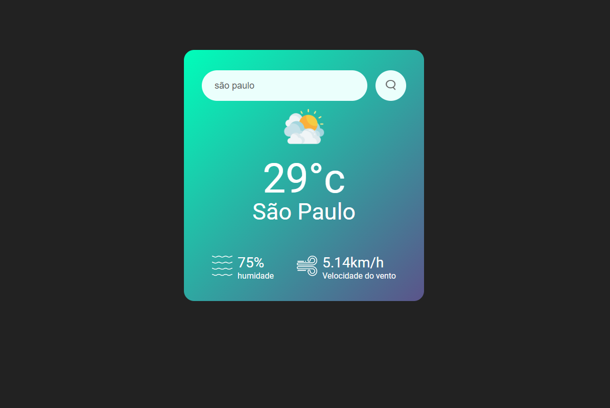

# Projeto Vue.js de Previsão do Tempo

## Descrição do Projeto
O projeto é uma aplicação Vue.js que permite aos usuários selecionar uma cidade e obter informações atualizadas sobre a previsão do tempo para essa localidade.

## Funcionalidades do projeto

- [x] Deve ter opção de selecionar a cidade desejada.
- [x] Lidar e mostrar dados recebidos pela API.
- [x] Design responsivo.

## Requisitos do Projeto

- [x] **Seleção de Cidade:** Os usuários podem escolher a cidade desejada.
- [x] **Integração da API:** Lidar com e mostrar os dados fornecidos pela API de previsão do tempo.
- [x] **Responsividade:** O layout se adaptar a diferentes tamanhos de tela.

## Instalação Normal

1. Clone o repositório.
2. Navegue até o diretório do projeto.
3. instale as dependências com o comando: `npm install`.
4. Inicie o aplicativo com o comando: `npm run serve`.
5. Acesse http://localhost:8080.